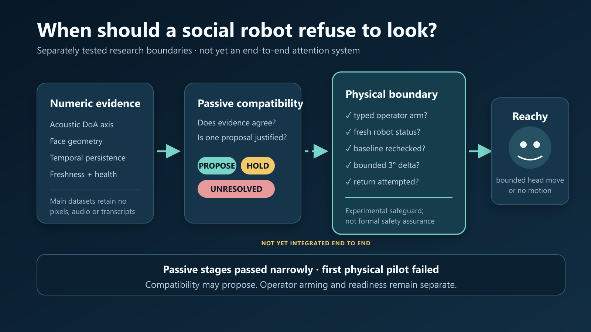

# Reachy Mini Abstention-First Attention

[](https://github.com/katepkh/reachy-mini-abstention-first-attention/actions/workflows/ci.yml)
[](pyproject.toml)
[](LICENSE)

**When should a social robot refuse to look?**

This research preview studies selective speaker grounding for Reachy Mini under an asymmetric cost: a false social or physical movement is treated as more costly than abstention. Local direction of arrival (DoA), ephemeral face geometry, temporal agreement, an explicit operator cue, and mechanical readiness are kept as separate permissions. Missing, stale, ambiguous, or conflicting evidence produces `ABSTAIN` or `HOLD`, not a guessed target.

> **Current boundary:** passive validation passed for the frozen single-site conditions below. Physical motion is **not validated**. The first supervised 3° motion trial failed its unchanged mechanical gate, and a corrected V4 path remains blocked by a disagreement between controller zero and the daemon's neutral reference.



## Start here

| If you want to... | Read... |
|---|---|
| Review the whole project critically | [`docs/EXTERNAL_REVIEW.md`](docs/EXTERNAL_REVIEW.md) |
| Reuse a rigorous review prompt | [`docs/REVIEW_PROMPTS.md`](docs/REVIEW_PROMPTS.md) |
| Read the compact paper-style account | [`docs/RESEARCH_NOTE.md`](docs/RESEARCH_NOTE.md) |
| Audit methods and frozen results | [`docs/METHODS.md`](docs/METHODS.md) and [`docs/RESULTS.md`](docs/RESULTS.md) |
| Inspect what failed and why | [`docs/FAILURE_LEDGER.md`](docs/FAILURE_LEDGER.md) |
| Check claim boundaries and data contents | [`docs/LIMITATIONS.md`](docs/LIMITATIONS.md) and [`docs/DATA_CARD.md`](docs/DATA_CARD.md) |
| Introduce the work to an expert group | [`DISCORD_MESSAGE.md`](DISCORD_MESSAGE.md) |

## The research question

The official Reachy Mini ecosystem already demonstrates how to read DoA and command the robot to look toward sound. This project begins at the unresolved permission boundary:

> How can weak acoustic and visual evidence justify a candidate for attention without being mistaken for speaker identity, human authorization, or mechanical readiness?

The architecture therefore separates two decisions:

```text
observation -> {candidate, abstain}
candidate + explicit cue + mechanical readiness -> {bounded command, block}
```

The intended contribution is not a historically first speaker-following demo. It is an auditable composition of selective prediction, hard-negative testing, data minimization, policy freezing, explicit authorization, and a narrow runtime motion governor.

## What was tested

| Stage | Experimental question | Frozen result |
|---|---|---|
| 2A — passive fusion matrix | Does visible-face geometry agree with the acoustic axis? | 15 accepted trials and 815 numeric observations. Alignment improved availability but did not establish source ownership. |
| 2A — retrospective tournament | What coverage is lost when temporal consensus becomes stricter? | Development-selected 3-hit policy produced 0/37 hard-negative confirmations but only 2/31 matching confirmations on the retrospective evaluation repetition. |
| 3V — fresh vertical holdout | Does the frozen shadow policy choose the correct direction and a bounded passive target? | 18 accepted trials; all four gates passed; 12/12 positive trials proposed movement; 0 hard-negative would-move rows; maximum target error 2.647°. |
| 3P — association-gated cue | Does the system remain blocked until an explicit cue, including no-cue controls? | 9 accepted trials; seven gates passed; 6 transitions and 3 fail-closed controls; 0 robot, actuation, or cloud requests. |
| 4A V3 — supervised mechanical pilot | Does one bounded 3° head-only command execute and return inside tolerance? | **Failed.** One physical trial and two head-only commands; measured motion 1.350°, target error 2.079°, return error 1.678°. |
| 4A V4 — corrected mechanical path | Can the diagnosed V3 defects be corrected without weakening thresholds? | Protocol code is prepared, but no V4 physical trial has run. Read-only preflight remains blocked by neutral-coordinate disagreement. |

These are small, correlated, single-site experiments. Observation-row denominators are not participant counts or independent samples.

## Central finding

Acoustic/visual alignment is useful **compatibility evidence**, but it is not proof that the visible person owns the sound:

- matching visible face + speech confirmed 62/71 tracked rows (87.3%);
- speech with no face confirmed 0/35 tracked rows;
- a silent visible face plus spatially separate phone speech still confirmed 13/63 tracked rows (20.6%);
- a visible silent face was present during all 13 false acoustic tracking episodes in that hard-negative condition.

This falsified assumption is more important than the positive coverage number. It motivated stricter temporal consensus, explicit `ABSTAIN`, no-cue controls, and an independent mechanical readiness gate.

## What the repository demonstrates—and what it does not

| Supported by the public record | Not established |
|---|---|
| A local pipeline can represent abstention and fail-closed gates. | Speaker identity, source ownership, or intent. |
| Frozen numeric artifacts reproduce the reported passive results. | Generalization beyond one robot, room, and primary operator. |
| Hard negatives can reveal false associations hidden by positive demos. | A multi-person participant study or socially valid eye-contact behavior. |
| Passive policy success does not silently authorize hardware. | Certified functional safety or formal verification. |
| The failed motion result was preserved without relaxed thresholds. | Successful physical speaker following or autonomous actuation. |

The strongest current artifact is the **permission architecture and failure-preservation process**. The empirical study is still a research preview.

## Code and evidence map

The repository contains 110 source modules (18,827 lines), 28 test modules (2,059 lines), one evidence verifier, and the frozen numeric artifacts. Forty source files retain explicit version suffixes because rejected and superseded protocol generations were preserved.

| Path | Responsibility | Review note |
|---|---|---|
| [`reachy_doa/`](reachy_doa) | Read-only DoA client, angle handling, confidence windows, offline policies, manifests, replay, and source-validity analysis. | The network client exposes GET-only access to an allowlisted private IPv4 endpoint. |
| [`reachy_stage2a/`](reachy_stage2a) | Local face detection, camera lifecycle, audio/visual fusion, trial protocol, recording, and policy tournament. | Face geometry is an availability signal, not identity or active-speaker proof. |
| [`reachy_stage3a/`](reachy_stage3a) | Passive motion-shadow controller and evaluation. | It computes counterfactual targets and has no hardware authority. |
| [`reachy_stage3v/`](reachy_stage3v) | Fresh vertical passive validation, audit/compliance checks, sampling, and frozen V3 policy. | Versioned modules expose the development trail but make navigation harder. |
| [`reachy_stage3p/`](reachy_stage3p) | Association-gated cue logic, calibration, V1–V7 analyses/policies, and result freezes. | This is an audit trail, not a minimal reusable package. |
| [`reachy_stage4/`](reachy_stage4) | Expiring read-only preflight, one-shot arming, relative bounded pose, robust SO(3) measurement, automatic return, and immutable result handling. | Command-capable code is experimental. V4 is unvalidated and must not bypass a failed preflight. |
| [`scripts/verify_results.py`](scripts/verify_results.py) | Standard-library verifier for public hashes and headline frozen claims. | This is the public evidence entry point. |
| [`tests/`](tests) | Self-contained component and protocol tests. | 142 software tests are not 142 robot trials and do not validate hardware. |
| [`evidence/`](evidence) | Derived CSV/JSON evidence, analyses, compliance records, and freeze manifests. | No raw audio, camera pixels, transcripts, or identity labels are included. |

### Known reproducibility gap

The public evidence was reorganized under `evidence/`, while several preserved acquisition and freeze modules retain their original laboratory `data/...` paths. Consequently:

- `python scripts/verify_results.py` verifies the public frozen claims;
- the unit tests exercise curated software components without a robot or private laboratory tree;
- the repository does **not yet** provide one command that rebuilds every analysis from the public layout or reproduces live hardware acquisition end to end.

Closing that gap is a priority for the next repository release.

## Reproduce what is currently reproducible

Verify 171 manifest-listed evidence files and the headline results using only the Python standard library:

```bash
python scripts/verify_results.py
```

Install the curated package and run 142 self-contained software tests:

```bash
python -m venv .venv
python -m pip install -e ".[test]"
python -m unittest discover -s tests -p "test_*.py"
```

Live camera acquisition is optional and isolated:

```bash
python -m pip install -e ".[live]"
```

No robot command should be sent merely because evidence verification or unit tests pass. Read [`SAFETY.md`](SAFETY.md) before any hardware work.

## What review would be most useful

The project is deliberately asking for criticism before stronger claims or further actuation. The highest-value questions are:

1. Is the abstention/coverage frontier framed and measured correctly at the **trial** level?
2. Which hard negatives would most strongly challenge the inference from spatial compatibility to speaker ownership?
3. Is an explicit phrase an appropriate laboratory authorization primitive, and what should replace it in human-robot interaction research?
4. Does the motion governor actually isolate perception from actuation, or are there hidden shared assumptions and failure paths?
5. What is required for a genuinely independent, multi-room evaluation when one operator performs the robot-side experiments?
6. Which parts are established engineering practice, which are a useful composition, and which—if any—constitute a research contribution?

See the full [`external review packet`](docs/EXTERNAL_REVIEW.md) and [`role-specific prompts`](docs/REVIEW_PROMPTS.md).

## Roadmap

1. Obtain adversarial external review of the claims, threat model, experiment design, and code boundary.
2. Make the public evidence layout directly replayable and add coverage/static-analysis reporting.
3. Resolve the daemon/controller neutral-coordinate disagreement using read-only diagnosis.
4. Run the already-bounded V4 four-direction mechanical pilot only after preflight passes consistently.
5. Preregister a multi-room recorded-voice benchmark with room- and voice-level holdouts.
6. Recruit additional consenting people before claiming live multi-speaker behavior or socially meaningful eye contact.

Detailed dependencies and realistic effort ranges are in [`docs/EXTERNAL_REVIEW.md`](docs/EXTERNAL_REVIEW.md#realistic-roadmap-and-timeline).

## Privacy, safety, citation, and licence

The public datasets retain derived measurements and state only—no camera pixels, raw audio, transcripts, or identity labels. This is data minimization, not formal anonymity; see [`docs/DATA_CARD.md`](docs/DATA_CARD.md).

The Stage 4 path is an operator-supervised research instrument, not a certified safety system. Never bypass a failed readiness check or weaken a threshold after observing an outcome.

See [`CITATION.cff`](CITATION.cff) for citation metadata. Code, documentation, and included derived evidence are Apache-2.0 unless a file states otherwise. The bundled YuNet model retains its upstream terms in [`models/README.md`](models/README.md).
