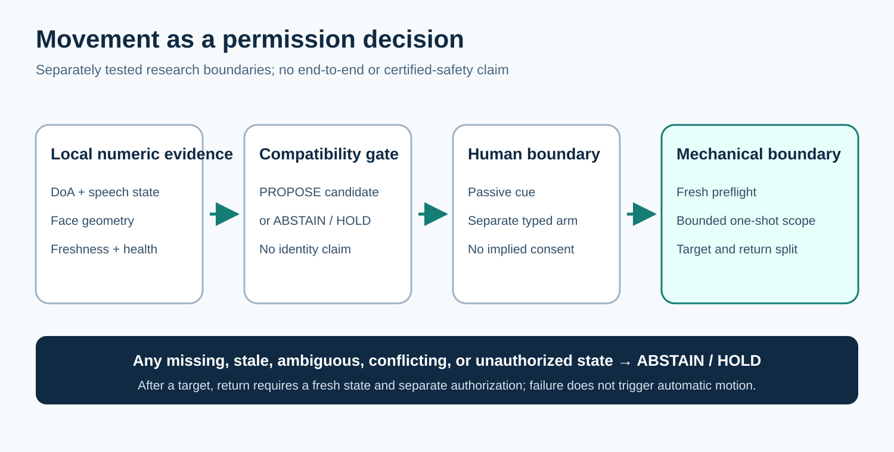
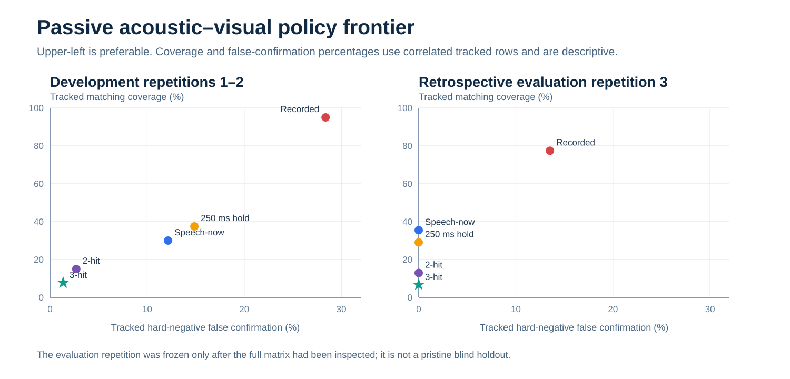

# Movement as a permission decision: an abstention-first research architecture for Reachy Mini

Kate P.

Working evidence manuscript · 25 September 2026

> **Working evidence manuscript — not submission-ready.** This document synthesizes completed component studies and preserved failures. It is not evidence that the primary live-speaker/playback-refusal behaviour works end to end. The governing completion boundary is [`PROJECT_CHARTER.md`](PROJECT_CHARTER.md).

## Abstract

Socially directed robot movement can appear plausible even when the perceptual evidence does not identify who produced a sound and the physical system has not demonstrated that it can execute the requested trajectory. This paper studies an abstention-first alternative on one Reachy Mini: acoustic direction, ephemeral face geometry, temporal persistence, operator interaction, and mechanical readiness remain separately inspectable boundaries. The public record stores derived numeric state rather than raw audio or camera frames. A 15-trial passive matrix showed that spatial compatibility improves availability but does not establish source ownership: a silent visible face paired with spatially separate playback still produced 13 confirmations among 63 tracked rows. A retrospectively selected strict policy eliminated hard-negative confirmations on its evaluation repetition at substantial coverage cost. A subsequently frozen 18-trial horizontal passive holdout and a nine-trial visual-cue boundary passed their predefined gates. A tracked audio–mouth synchrony instrument then passed a 12-trial single-setup development pilot, but remains unconfirmed. The only supervised physical 3° trial failed its unchanged target and return tolerances. The result is therefore not a speaker-following system or a safety certification. It is an auditable staged composition that treats abstention and preserved physical failure as primary results, and it preregisters the multi-room evidence required before stronger claims.

**Keywords:** human–robot interaction; selective prediction; abstention; direction of arrival; audio–visual association; runtime gating; Reachy Mini

## 1. Introduction

A robot that turns toward speech makes two different commitments. It proposes that a direction is socially relevant, and it permits a physical action. Direction of arrival (DoA) alone does not identify the speaker; a visible face at a compatible angle can be silent while a nearby device plays speech. Even a correct target estimate does not establish that the robot can execute and return from a small movement within an experimental tolerance. Treating these uncertainties as one end-to-end confidence score hides where evidence was lost.

This work asks:

> How can a social robot keep weak acoustic/visual compatibility, operator interaction, and mechanical readiness as separately inspectable boundaries before movement is permitted?

The project assigns a deliberately asymmetric cost: a false movement is treated as more consequential than abstention. `ABSTAIN` and `HOLD` are therefore explicit outputs rather than missing predictions. Figure 1 shows the resulting research architecture.



The contributions are:

1. a passive, data-minimizing acoustic/visual pipeline with first-class hard-negative conditions;
2. a sequence of frozen passive evaluations that reports the coverage sacrificed by stricter refusal rules;
3. an explicit separation between candidate compatibility, a system-issued visual cue, typed operator arming, and mechanical readiness;
4. a content-addressed record that preserves a failed physical trial without weakening its thresholds; and
5. a frozen 54-trial audio–mouth synchrony confirmation design that binds the successful development candidate without retuning it.

The contribution is an experimental and engineering composition. No component is claimed to be historically novel, and the stages have not been validated as one integrated speaker-to-motion system.

## 2. Related work

### 2.1 Reachy Mini and robot audition

Pollen Robotics publishes a [Reachy Mini DoA example](https://github.com/pollen-robotics/reachy_mini/blob/main/examples/sound_doa.py) that converts a speech direction into a world-coordinate look target. Robot audition is a substantially broader field: systems such as HARK address localization, tracking, separation, recognition, moving sources, and ego-noise in dynamic environments [1]. The present work uses only a scalar DoA endpoint and speech/validity state. It contributes no new localization, separation, beamforming, or speech-recognition algorithm; its question begins downstream, at the refusal boundary.

### 2.2 Audio–visual active-speaker inference

Active-speaker detection combines synchronized audio and facial evidence to determine which visible person is speaking. AVA-ActiveSpeaker provides large-scale labelled audiovisual data [2], while TalkNet uses temporal encoders and cross-attention [3]. Those systems illustrate why geometric overlap is not speaker ownership. The principal robot-side studies here store no waveform, video, transcript, face embedding, diarization state, or identity label. A later development instrument uses only local microphone level and normalized lip aperture; even a positive synchrony result is called a candidate association, not identity.

### 2.3 Selective prediction, assurance, and social gaze

Selective prediction formalizes the risk–coverage trade-off introduced by a reject option; SelectiveNet is one established example [4]. This project borrows that vocabulary but does not train a selective neural model or estimate a population risk curve. Runtime-assurance and Simplex-style architectures go further than the present safeguards by defining trusted components, safe sets, monitor timing, switching logic, and sometimes formal proofs [5]. Accordingly, the physical boundary here is called an experimental motion governor, not a runtime-assurance system.

Head orientation also does not establish eye contact, joint attention, turn taking, or social benefit. Reviews of social gaze in HRI distinguish human, design, and technical questions [6], and participant studies of conversational gaze evaluate perceptions that this project does not measure [7]. “Social attention” is therefore a motivating application, not an empirical outcome.

## 3. Methods

### 3.1 Setting, units, and data minimization

The robot-side experiments used one borrowed Reachy Mini Wireless, one primary operator, and one site. Frames and telemetry rows are repeated observations within trials; the trial is the inferential unit. Controlled recorded voices are stimuli, not additional participants.

Camera frames were processed locally and discarded after deriving face count, confidence, and geometry. The main evidence stores no pixels. The DoA interface supplied numeric direction, speech/validity state, and timing; the public evidence stores no waveform or transcript. Temporary encrypted compliance clips used in one narrow audit were deleted after review and are not public artifacts. Removing media reduces exposure but is not a proof of anonymity.

### 3.2 Staged permission architecture

Stage 2A fused one-face geometry with the local acoustic axis and freshness checks. Fifteen accepted trials covered silent face, speech without a face, matching face and speech, a silent face with spatially separate phone speech, and a partial-edge face. No command path existed.

Five policies were replayed over the frozen numeric matrix. Repetitions one and two were designated development and repetition three evaluation. The selection rule first preferred zero hard-negative confirmations and then maximized matching coverage. Because the complete matrix had already been inspected before this split was formalized, the evaluation is labelled retrospective rather than blind.

Stage 3V froze a shadow policy before collecting a fresh 18-trial horizontal off-axis set. Positive headings were ±10° and ±20°; six trials were hard negatives. Gates required zero hard-negative proposals, correct turn sign, coverage at every heading, and bounded target error. Outputs were counterfactual targets only.

Stage 3P tested a passive visual-cue boundary. Six centre-to-vertical transitions required three stable centred compatibility rows before displaying `MOVE UP` or `MOVE DOWN`; three controls were required to time out without a cue. The repeated phrase supplied speech energy only. The program received no transcript and had no robot-command capability.

Stage 4A used an expiring read-only preflight, an exact typed arm, a 3° head-only target, and a one-shot session. Body yaw, antenna, torque, and motor-mode commands were excluded. One target-and-return trial was run under a frozen V3 protocol. A later diagnostic corrected analysis and timing defects in code, but the failed V3 result was not retried or relabelled.

### 3.3 Audio–mouth synchrony development

The first laptop-only instrument correlated local microphone energy with pixel change in a fixed mouth box. A frozen 12-trial development pilot rejected it when none of 240 settings met the selection rule. A separately versioned V2 instrument used tracked landmarks 13 and 14 for lip aperture, normalized by outer-eye distance, with a pinned MediaPipe model/runtime and objective signal-quality gates.

V2 searched 45 settings using repetitions one and two only. The deterministic tie-break selected minimum correlation 0.25, maximum absolute lag 120 ms, and three-sample smoothing. Repetition three was then evaluated once as internal validation. All 23 attempts were retained; 12 passed quality gates and 11 failed them. These data nominate an instrument candidate but do not confirm it.

### 3.4 Integrity and analysis

Protocol and policy fingerprints, SHA-256 manifests, immutable result freezes, complete attempt accounting where available, and explicit command counts define the audit boundary. Threshold changes after viewing a physical outcome are prohibited. Stage 3V trial fractions are accompanied by nominal two-sided 95% Wilson intervals. Its ablations, sensitivity analysis, leave-one-trial-out deletion, and finite operating points are post-hoc diagnostics, not a second holdout or causal component analysis.

Table 1 summarizes the frozen evidence. Table 2 separates trials from attempts and prevents software tests or correlated rows from being misreported as empirical sample size.

**Table 1. Frozen outcomes and interpretation boundaries.**

<!-- Generated by scripts/build_paper_artifacts.py; do not edit. -->

| Stage | Unit and denominator | Frozen observation | Interpretation boundary |
|---|---|---|---|
| 2A retrospective evaluation | 1 matching trial; 31 tracked rows; 37 tracked hard-negative rows | 3-hit policy confirmed 2/31 matching and 0/37 hard-negative rows | Comparative internal evidence; complete matrix was inspected before the split |
| 3V passive horizontal holdout | 18 accepted trials from 21 attempts | 12/12 positives proposed; 0/6 accepted hard-negative trials proposed; maximum target error 2.647° | Small single-site holdout; no motion authority |
| 3P passive cue boundary | 9 accepted trials from 18 attempts | 6/6 transitions cued; 0/3 controls cued; 0 commands | Visual instruction only; not identity, consent, or authorization |
| AV synchrony V2 pilot | 12 canonical trials from 23 attempts | Development 4/4 positive and 0/4 negative; internal validation 2/2 positive and 0/2 negative | Single-person instrument development; not confirmation |
| 4A V3 physical pilot | 1 commanded trial | **FAIL**; motion 1.350°, target error 2.079°, return error 1.678° | No successful physical validation; thresholds unchanged |

**Table 2. Attempt accounting.**

<!-- Generated by scripts/build_paper_artifacts.py; do not edit. -->

| Dataset | Accepted/analysed trials | Recorded attempts | Excluded/superseded | Primary unit |
|---|---:|---:|---:|---|
| Stage 2A passive matrix | 15 | Not reconstructable publicly | Not reconstructable publicly | Trial |
| Stage 3V horizontal holdout | 18 | 21 | 3 | Trial |
| Stage 3P cue boundary | 9 | 18 | 9 | Trial |
| AV synchrony V2 pilot | 12 | 23 | 11 | Ten-second trial |
| Stage 4A V3 physical pilot | 0 passing | 1 | 1 failed, retained | Commanded physical trial |

## 4. Results

### 4.1 Spatial compatibility did not establish source ownership

The Stage 2A matrix contained 815 rows, 801 of which had valid DoA responses. Matching face and speech produced 62 confirmations among 71 tracked rows, while speech without a visible face produced 0/35. Crucially, phone speech spatially separated from a silent visible face produced 13 confirmations among 63 tracked rows. Spatial agreement therefore supported compatibility but not the inference that the face owned the sound.

The policy tournament exposed the expected safety–coverage trade-off (Figure 2). The development-selected three-hit policy produced 0/37 hard-negative confirmations on the retrospective evaluation repetition, but only 2/31 matching confirmations. Stricter temporal consensus removed observed false confirmations at the cost of availability; the result does not establish universal optimality.



### 4.2 Fresh passive stages passed narrow gates

Stage 3V accepted 18 trials from 21 attempts. All 12 matching-positive trials produced at least one passive proposal; none of six accepted hard-negative trials produced a would-move row; no proposal had the wrong turn sign; and maximum target error was 2.647°. The nominal Wilson interval for positive coverage was 75.8%–100%, while the 0/6 hard-negative fraction had an upper endpoint of 39.0%. The uncertainty, rather than the perfect sample fractions, defines the appropriate interpretation.

Stage 3P accepted nine trials from 18 attempts. All six transitions displayed the required visual instruction, and all three controls timed out without one. It emitted zero robot, actuation, and cloud requests. This result validates a narrow system-issued cue boundary, not a human authorization mechanism.

### 4.3 Synchrony pilot produced a frozen candidate, not confirmation

The fixed-box V1 instrument was rejected: 0/240 settings passed. V2 retained 12 quality-passing trials from 23 attempts. Eight of 45 development settings were eligible. The selected candidate produced candidates for 4/4 development positives and 0/4 development hard negatives, then 2/2 and 0/2 respectively on the small internal validation. The exact candidate, protocol, code, model, runtime, and canonical-input hashes are frozen. The same operator, setup, device path, and acquisition process were shared, so this is instrument development only.

### 4.4 The physical pilot failed

The single Stage 4A V3 trial issued two head-only commands. Robust reconstruction measured 1.350° movement against the requested 3°, 2.079° target error, and 1.678° return error. The predefined mechanical gate failed. Thresholds were not weakened, and passive successes did not override the failure.

A controlled later command-free series measured repeatable 2.529°–2.752° mean post-wake offsets from nominal identity, all outside the unchanged 1° project gate. Offline reconstruction of a possible successor matched the official daemon 1.9.0 interpolation law at 201 ideal samples per leg and stayed at least 42.706° inside supplied configured joint bounds. These calculations do not test collision, cable clearance, current, load, tracking, scheduling, or the actual unit’s recovery behavior. The proposed successor remains non-executable.

## 5. Discussion

The central result is a sequence of refusals rather than a successful demonstration. A visible face and a plausible DoA can agree while the sound comes from elsewhere. Temporal consensus can suppress observed hard negatives while destroying matching coverage. A passive target can pass its software gate while a later physical pilot fails. These are distinct uncertainties and should not be collapsed into one confidence value.

The work also shows why protocol behavior is part of the empirical result. The V1 synchrony instrument was rejected rather than tuned after failure. V2 commissioning and quality failures were retained. The failed physical trial remained failed after diagnosing its instrumentation. This auditability does not prove correctness, but it prevents a polished demo from erasing negative evidence.

The present architecture is conservative by design. Its cost is abstention, slower progression, additional operator work, and low coverage under strict consensus. Whether that trade-off is socially acceptable requires a participant study; whether it is mechanically adequate requires qualified review and new physical evidence. Neither question is answered here.

## 6. Ethics and safety

The project deliberately avoids identity recognition, transcript processing, raw-media publication, and autonomous motion claims. Consent is required for every recorded voice stimulus. A recorded voice is not counted as a participant, and synchrony does not imply identity, intent, consent, or authorization.

The robot is borrowed. This repository contains no private correspondence or external-authorization record and makes no public evidentiary claim about those external decisions. After two contained fail-closed rehearsals exposed implementation defects, a bounded temporary-daemon observation retained 193 simultaneous present/target frames over 10 seconds. All target states were coherently `UNSET`; the trace client sent zero application messages and zero robot commands. Stock v1.9.0 was restored healthy with motors disabled, and the observational patch was not persistently installed. This validates the bounded receive-only measurement path but does not establish a defined target, target tracking, a safe return, or motion authorization.

Physical failure handling is consequently conservative: do not start competing daemons, do not equate process exit with torque removal, and do not command an automatic return after an unresolved target failure. These are project boundaries, not manufacturer-certified instructions. Further hardware activity requires authorization and technical review performed outside this public evidence package, plus an exact recovery sequence and a newly frozen protocol.

## 7. Threats to validity

Table 3 states the principal validity threats without converting mitigations into guarantees.

**Table 3. Threats to validity and treatment.**

<!-- Generated by scripts/build_paper_artifacts.py; do not edit. -->

| Threat | Consequence | Treatment in this work |
|---|---|---|
| Single operator and single robot | Operator-specific speech, appearance, timing, setup skill, and one borrowed unit are confounded. | Limit claims to a single-site research preview; use additional operators and robots before generalization. |
| Single-site room dependence | Reflection, noise, microphone geometry, and illumination may drive the observed outcomes. | The next protocol requires three newly bound rooms and reports results by room. |
| Correlated observations | Telemetry rows within one trial are not independent samples. | Use the trial as the inferential unit; row fractions remain descriptive. |
| Small trial counts | Perfect observed fractions retain wide uncertainty (for example, Stage 3V 0/6 has a 39.0% Wilson upper endpoint). | Report denominators and intervals; avoid population-safety language. |
| Researcher involvement | The same research process designed, operated, repeated, audited, and analysed several stages. | Retain every attempt, freeze rules before collection, and seek independent replication. |
| Retrospective Stage 2A split | The full matrix had been inspected before development/evaluation labels were formalized. | Call it comparative internal evidence, not a blind holdout. |
| V2 acquisition dependence | Eleven failed attempts preceded twelve quality-passing trials; repeated captures may select easier performances. | Apply only outcome-blind gates, retain failures, and prohibit pilot files in confirmation. |
| Microphone and device limitations | The V2 signal is tied to one local audio path; the exact public device identity was not recorded, and headset placement can confound live speech versus playback. | Bind one fixed microphone/camera configuration before confirmation; never wear a headset microphone during trials. |
| Failed physical validation | The only commanded 3° trial missed its target and return tolerances. | Preserve the failure; do not infer mechanical safety from offline IK or passive results. |
| No end-to-end test | Compatibility, passive cueing, and the command boundary were tested separately. | Do not claim speaker following, autonomous safety, or social attention behavior. |
| Incomplete hardware authorization and review | Unit-specific failure recovery and permission for further hardware activity are outside the research evidence. | Keep the successor non-executable; this paper makes no claim of external authorization and stores no correspondence. |

## 8. Frozen next study

The next-study design is a 54-trial confirmation across three newly bound physical rooms, three visible-person headings, two matching conditions, and four hard negatives. Two consented voice recordings are allocated equally, including two trials per voice in every room–heading block. The earlier centred-person ambiguity is resolved by counterbalancing opposite playback at −20° and +20°. Exact room identities, voice files, microphone, camera, browser, marks, and playback settings must be privately bound and hashed before the first preview or capture; they may not be chosen after outcomes are visible.

Collection is paused before Trial 1 because the current five-column laptop recorder contains no acoustic direction or Stage 3V policy inputs. It therefore cannot identify the frozen spatial comparator, independent heading errors, wrong-sign outcomes, or streaming first-proposal latency. The design may resume only after an acoustic-direction instrument is validated and the execution contract is refrozen, or as an explicitly narrower synchrony-only exploratory study. Partial private Room A preparation is not a confirmation result.

The V2 thresholds and quality gates are unchanged. Exclusions are outcome-blind, every attempt is retained, and a failed attempt may only repeat the same scheduled card after correcting the recorded objective issue. The primary endpoints are matching-positive coverage, hard-negative false-proposal rate, and paired hard-negative difference from the frozen spatial comparator. Analysis uses trial-level Wilson intervals and an exact two-sided McNemar test. The pass rule requires 0/36 hard-negative proposals, at least 15/18 matching-positive proposals, zero wrong-sign proposals, maximum target error no greater than 8°, and improvement over the spatial comparator. This is a passive study; it authorizes zero motion, torque, calibration, or motor-mode commands.

**Table 4. Frozen AV-synchrony confirmation conditions.**

<!-- Generated by scripts/build_paper_artifacts.py; do not edit. -->

| Frozen condition | Role | Trials | Purpose |
|---|---|---:|---|
| `live_visible_continuous` | matching positive | 9 | Visible operator speaks naturally from the marked heading. |
| `live_visible_interrupted` | matching positive | 9 | Visible operator alternates about one second of speech with one second of silence. |
| `silent_face_colocated_playback` | hard negative | 9 | Visible operator remains silent while consented speech plays beside the face. |
| `silent_mouthing_shifted_playback` | hard negative | 9 | Visible operator mouths silently out of time while consented speech plays beside the face. |
| `silent_face_opposite_playback` | hard negative | 9 | Visible operator remains silent while consented speech plays from the opposite mark. |
| `live_speech_plus_opposite_playback` | hard negative | 9 | Visible operator speaks while an independent consented recording plays from the opposite mark. |

Protocol fingerprint: `1e7f727d5fbf34bfd1be9464787151849b10e880eb8fcde758dce465f49b2bf8`. The 54 trials comprise 18 matching positives and 36 hard negatives across three rooms and three visible-person headings.

## 9. Reproducibility

All four manuscript tables and both figures are generated by `scripts/build_paper_artifacts.py` from seven content-addressed JSON sources. `docs/paper/generated/ARTIFACT_MANIFEST.json` records every source and output hash. A standard-library verifier checks 171 manifest-listed evidence files and frozen assertions. The test environment is pinned in `requirements-test.lock`; browser-model assets have independent hashes; and `docs/HARDWARE_SOFTWARE_INVENTORY.md` distinguishes observed versions from missing acquisition metadata.

From the repository root:

```bash
python scripts/verify_paper_artifacts.py --check
```

This command verifies evidence, frozen protocols, generated tables and figures, offline robustness/fault artifacts, the successor review packet, and the curated software tests. It opens no robot, camera, microphone, or external network connection. The resulting deterministic log is stored under `evidence/analysis/`.

Reproducibility has limits. Deleted temporary compliance media cannot be reconstructed; the public Stage 2A tree does not establish a complete attempt denominator; V2 numeric attempts remain private; and live acquisition or hardware behavior cannot be reproduced by an offline verifier.

## 10. Conclusion

The evidence does not justify autonomous speaker-following. It supports a narrower proposition: embodied attention benefits from keeping perceptual compatibility, human interaction, and mechanical permission as separate, falsifiable boundaries. Hard negatives exposed that geometry was not source ownership; stricter consensus revealed a cost in coverage; and the only physical pilot failed. Preserving these outcomes produces a more credible basis for the next multi-room passive study and for deciding whether any later motion experiment should occur at all.

## References

1. Nakadai, K. et al. [Robot audition for dynamic environments using HARK](https://www.jp.honda-ri.com/api/upload/document/entry/20121018/Nakadai_2012_941_6250.pdf).
2. Roth, J. et al. [AVA-ActiveSpeaker: an audio-visual dataset for active speaker detection](https://research.google/pubs/ava-activespeaker-an-audio-visual-dataset-for-active-speaker-detection/).
3. Tao, R. et al. [Is someone speaking? Exploring long-term temporal features for audio-visual active speaker detection](https://arxiv.org/abs/2107.06592) (TalkNet).
4. Geifman, Y. and El-Yaniv, R. [SelectiveNet: a deep neural network with an integrated reject option](https://proceedings.mlr.press/v97/geifman19a.html).
5. NASA Langley Research Center. [A formal verification framework for runtime assurance](https://shemesh.larc.nasa.gov/fm/papers/NFM2024-draft.pdf).
6. Admoni, H. and Scassellati, B. [Social eye gaze in human–robot interaction: a review](https://publications.ri.cmu.edu/social-eye-gaze-human-robot-interaction-review).
7. Andrist, S. et al. [Conversational gaze aversion for humanlike robots](https://graphics.cs.wisc.edu/Papers/2014/ATGM14/).
